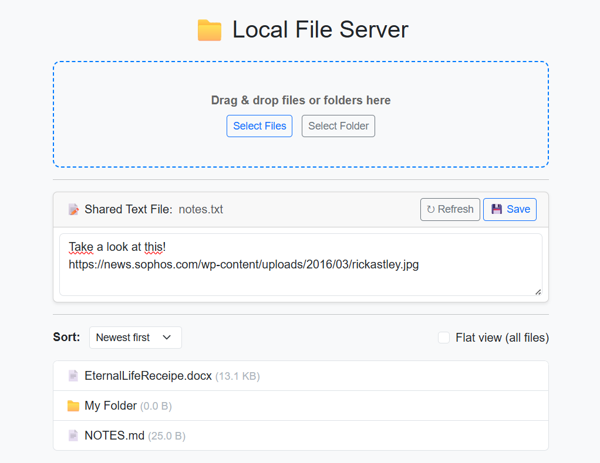

# Local Share
A browser-based local network server to upload/download files, full folders, and share notes.

Local Share lets you share any folder on your local network so other devices can easily upload and download files — including full folders — directly from their browsers.
It also includes a simple shared notepad for quickly exchanging notes, links, and text between users.



---

## How to Use

Serve the `uploads` folder in the current directory by default:
```bash
uv run localshare.py
```

Share a specific folder on your machine:
```bash
uv run localshare.py /path/to/folder
```

Specify the name of the shared text file (default is `notes.txt`):
```bash
uv run localshare.py --notes mynotes.txt
```

Allow deletion of files and folders via the web interface (disabled by default):
```bash
uv run localshare.py --enable-delete
```

Alternatively, use `uvicorn` directly to serve the app:
```bash
uv run uvicorn localshare:app --host 0.0.0.0 --port 8000 --reload
```

## Features

- Upload and download files and folders
  - Drag-and-drop support for files and folders
  - Upload entire folders at once
  - Download folders as ZIP files
- Shared text file (notepad) for notes, links, and messages
- No authentication — accessible to anyone on the same network
- Optional “flat view” to display all files in subfolders
- Simple, responsive web interface built with **FastAPI** and **Bootstrap**

## Notes

- This app is meant for **trusted local networks only**.
- Anyone on the same LAN can access the shared folder.
- Avoid exposing it to the public internet without proper authentication.

---

Built with ❤️ using FastAPI.
